# HOL SP Aguas - CAI Inference & Open Data APIs

Este projeto é uma coleção de notebooks Jupyter desenvolvidos para analisar dados de chuva obtidos da API pública da São Paulo Águas (SPAguas). O objetivo é extrair, explorar e modelar dados meteorológicos para avaliar riscos relacionados à precipitação, criar dashboards operacionais com alertas, e integrar modelos de linguagem (LLMs) para fornecer explicações de eventos e um chat conversacional.

O projeto utiliza dados em tempo real de estações meteorológicas, processando informações como acumulado de chuva, localizações e timestamps, com foco em aplicações práticas para gestão de recursos hídricos e prevenção de riscos.

## Arquivos .ipynb

Aqui está a lista de todos os notebooks Jupyter no projeto, com uma breve descrição de cada um:

1. **lab00/00-extract_dados_chuva.ipynb** [Detalhes](lab00/README-00.md)  
   Notebook responsável pela extração de dados de chuva da API da SPAguas. Faz requisições para obter medições atuais, normaliza os dados em um DataFrame pandas e salva em formatos JSON e CSV.

2. **lab01/01-exploracao_dados_chuva.ipynb** [Detalhes](lab01/README-01.md)  
   Foca na exploração e visualização dos dados de chuva. Inclui coleta de dados, processamento em DataFrame e geração de gráficos, como barras horizontais mostrando as top 15 estações com maior acumulado de chuva.

3. **lab02/02-modelo-de-risco-real.ipynb** [Detalhes](lab02/README-02.md)  
   Implementa um modelo de risco baseado nos dados de chuva. Analisa padrões e calcula probabilidades de eventos extremos para avaliação de riscos reais.

4. **lab03/03-op-modelo-dashboard-alertas.ipynb** [Detalhes](lab03/README-03.md)  
   Cria um dashboard operacional que integra o modelo de risco com alertas. Permite monitoramento em tempo real e notificações baseadas em thresholds de precipitação.

5. **lab04/04-llm-explicando-eventos.ipynb** [Detalhes](lab04/README-04.md)  
   Utiliza modelos de linguagem (LLMs) para explicar eventos meteorológicos. Interpreta dados de chuva e fornece narrativas ou insights automatizados sobre ocorrências.

6. **lab05/05-llm-chat-conversacional.ipynb** [Detalhes](lab05/README-05.md)  
   Implementa um chat conversacional alimentado por LLMs. Permite interações com o usuário sobre os dados de chuva, respondendo perguntas e fornecendo análises contextuais.

7. **lab99/99-teste-PIB-Analysis.ipynb** [Detalhes](lab99/README-99.md)  
   Notebook de teste para análise de dados de PIB (Produto Interno Bruto). Possivelmente um experimento separado ou teste de integração com dados econômicos.

## Dependências

O projeto utiliza as seguintes bibliotecas Python, listadas em `requirements.txt`:
- `requests` para requisições HTTP
- `pandas` para manipulação de dados
- `numpy` para cálculos numéricos
- `matplotlib` para visualizações
- `openai` para integrações com LLMs
- `sidrapy` para acesso a dados do IBGE (usado no lab 99)

Para instalar as dependências, execute: `pip install -r requirements.txt`.

Certifique-se de ter um ambiente Python configurado.

# Como Usar

## Acessando o CAI
Utilizando o link disponibilizado na planilha faça login com seu usuário e senha na plataforma.
__Use navegador anônimo__
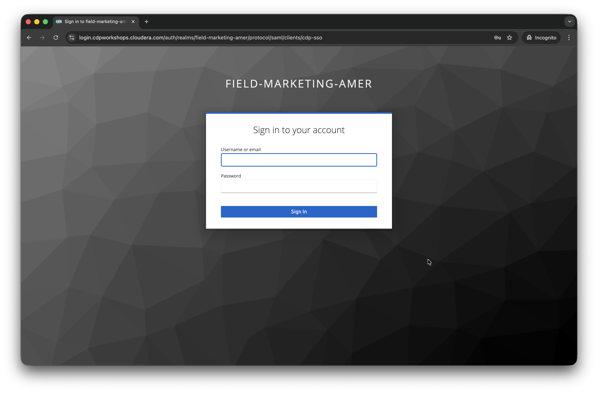

Então você vai ter a visão de todos os componentes da Cloudera.
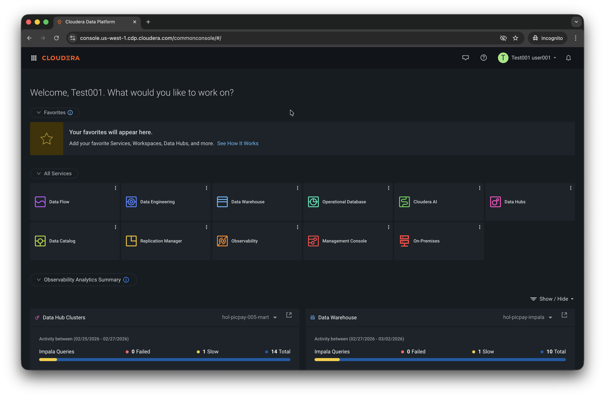

Clique em Cloudera AI.
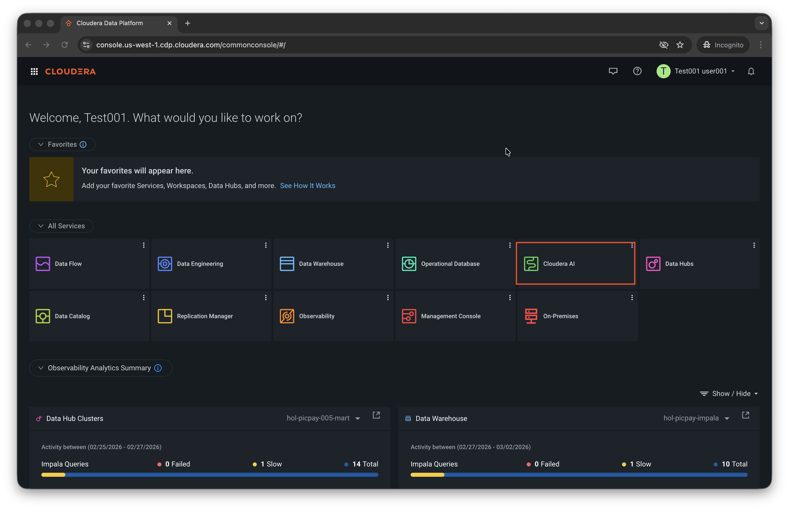

Você estará na Home do Cloudera AI, aqui você poderá acessar nos labs futuros as LLMs.
Agora vamos acessar nosso Workbench. __Clique em AI Workbenches__
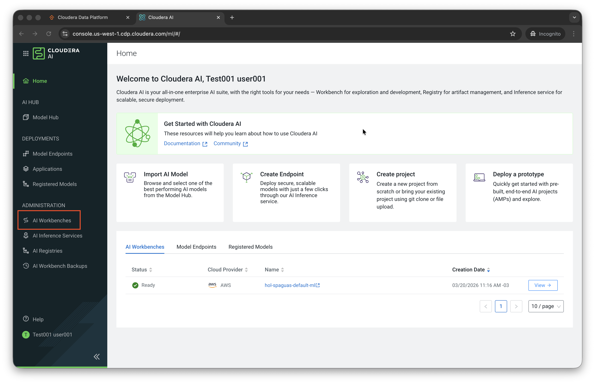

Acesse nosso Workbench __uma nova aba deve abrir__.
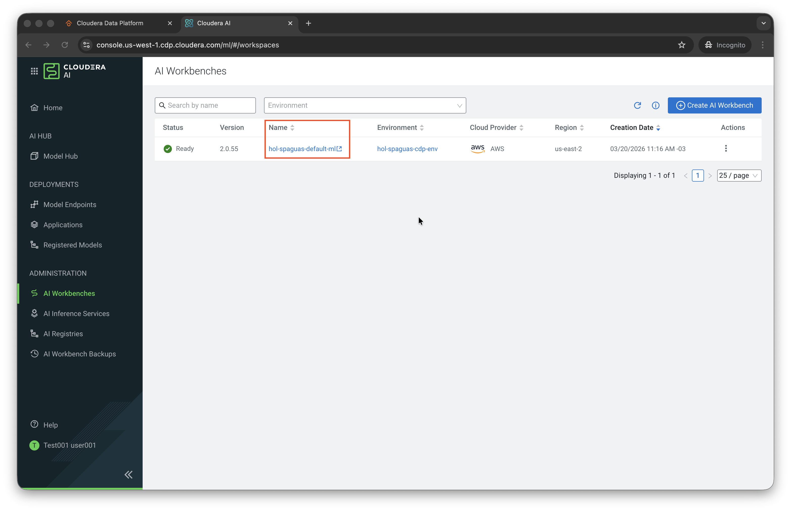

Esta é a home do nosso Workbench.
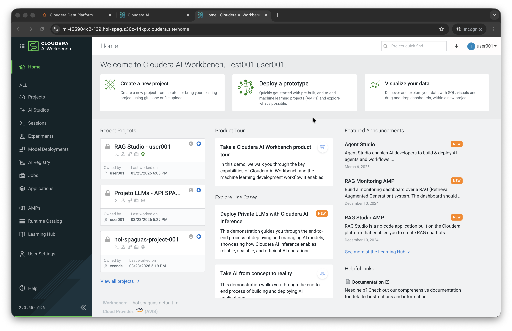

## Clonando Projeto

Vamos agora criar um novo projeto, para clonar os dados deste laboratório nele.
__Copie a URL do nosso lab__
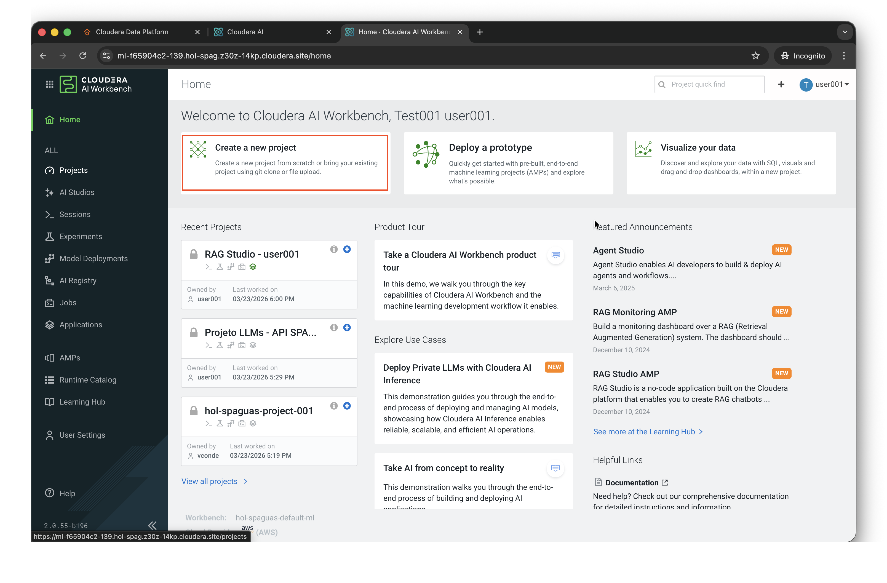

- Coloque um nome para o Projeto.
`SPAguas Analytics - ML & GenAI`
- Adicione uma descrição ao Projeto.
`Projeto para exploração de dados, coleta de dados, análises simples e avançadas, e interação com LLM`
- Clique em Git.
- E por ultimo adicione a URL do nosso git no campo HTTPS.
`https://github.com/vitorconde/CAI_RAG_APIs`
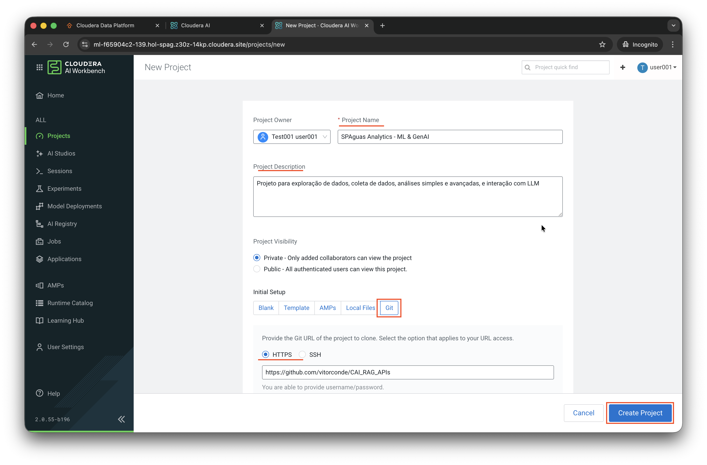

Podemos ver algumas opções de Runtimes para serem configuradas, tanto nas versões de Editores quanto de Kernel, Uso de GPU ou Não, e Versões.
***Porém não vamos alterar nada disso agora.***
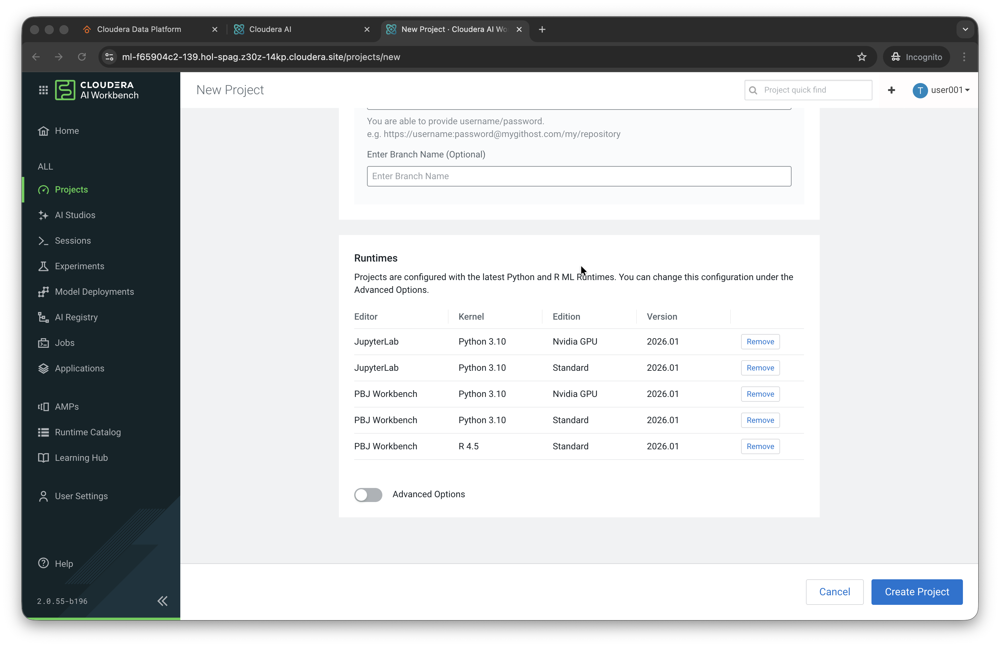

- Clique em Create Project.

## Criando Sessão de ML

Na tela do projeto, poderemos visualizar tanto o Readme, quanto os arquivos do nosso projeto.
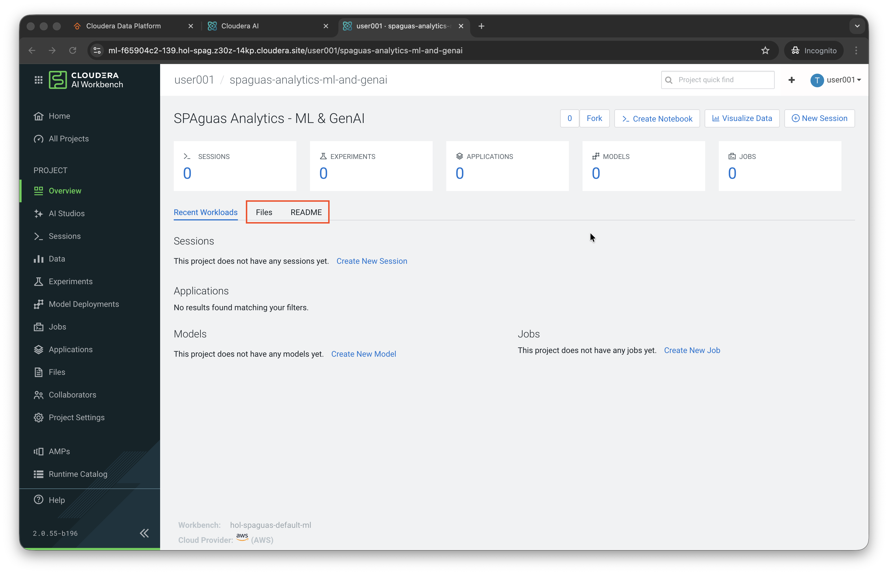
É bom verificar se está tudo lá.

E então podemos criar nossa sessão para processar e analisar nossos dados.
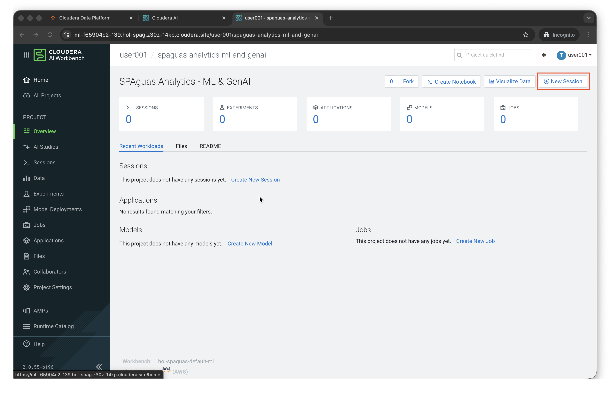

As configurações da Sessão devem ser:
Session Name: `<seu_user>-sess`

Runtime: Editor -> JupyterLab
         Kernel -> Python 3.10
         Edition -> Standard

Não vamos utilizar Spark nem GPU neste projeto por enquanto.
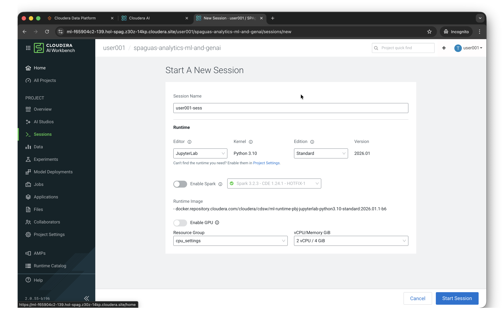

- Clique em Start Session.

Temos algumas sugestões de códigos para serem utilizados, a própria plataforma da essas sugestões/snippets para o usuário.
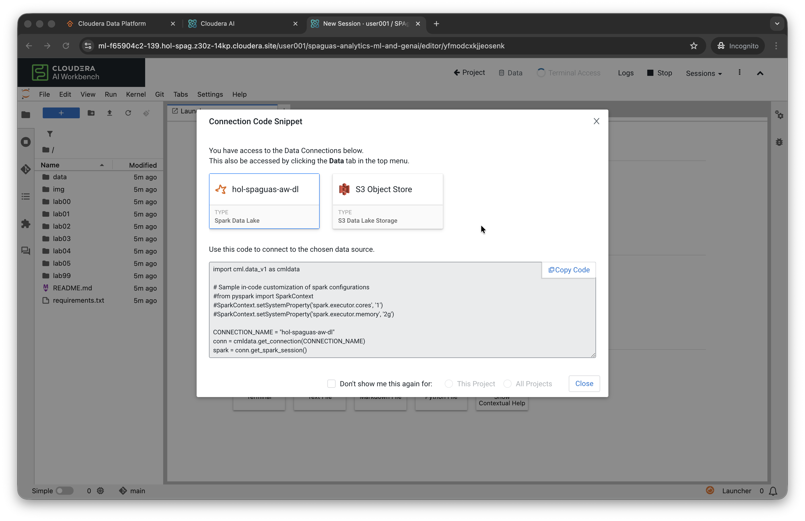

- Clique em Close.

E agora você está pronto para começar os laboratórios.
Volte para o Laboratório 00 e comece a realizar os exercícios.
Leia atentamente os exercícios e as explicações, e caso tenha dúvidas pergunte!
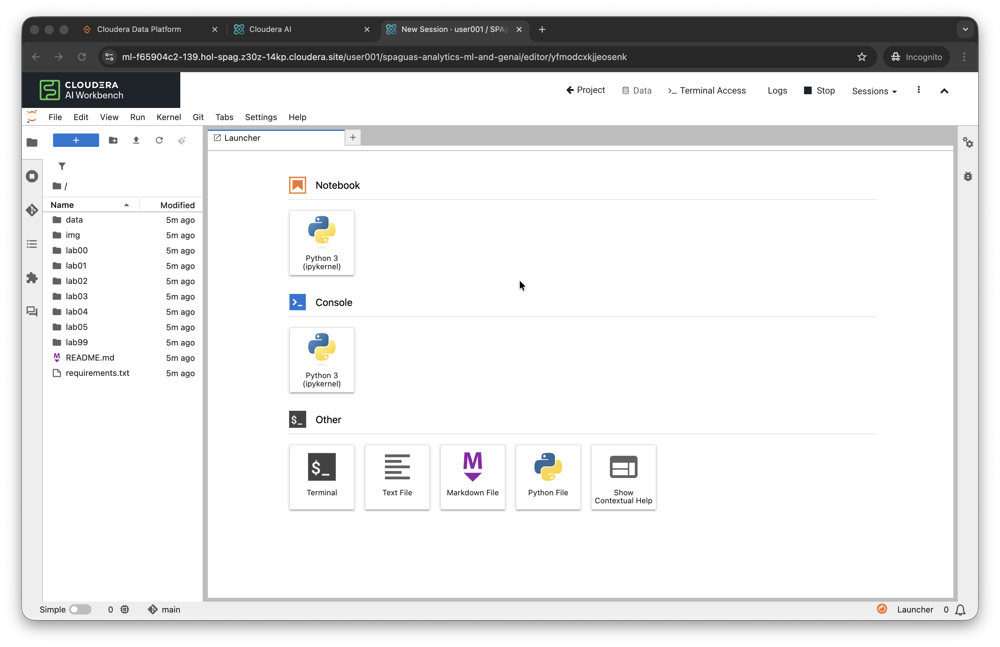

Obrigado!