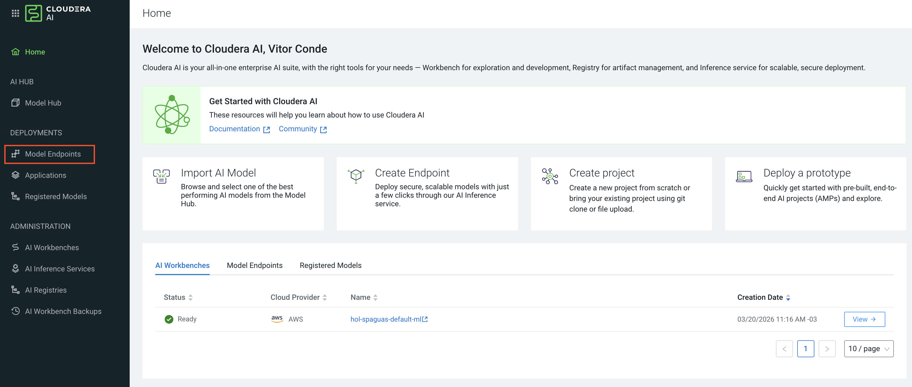
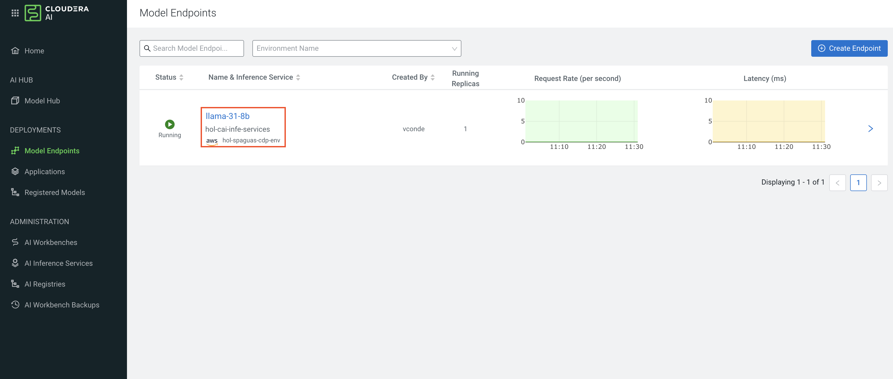
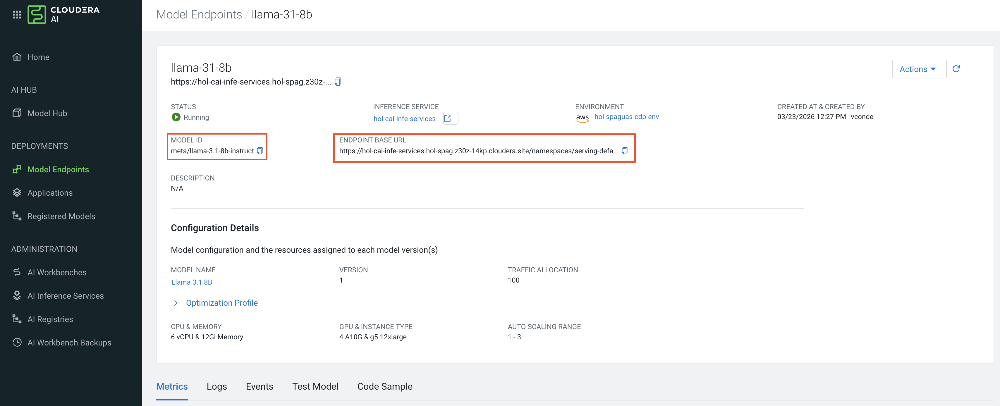
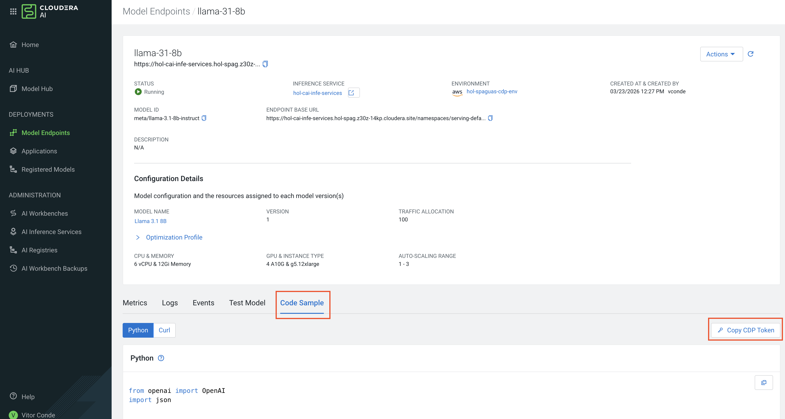

# Lab 04: LLM Explicando Eventos

## Descrição

Este notebook integra um modelo de linguagem (LLM) para explicar cenários hidrológicos baseados nos dados de risco. Utiliza a API do Cloudera AI Inference (compatível com OpenAI) para enviar contexto dos dados e receber explicações narrativas sobre estações críticas.

## Funcionalidades Principais

- **Configuração LLM**: Cliente OpenAI apontando para endpoint Llama 3.1-8B, com chave de API.
```
BASE_URL = ""
API_KEY = ""
MODEL_NAME = ""
```
Vamos buscar a configuração anterior seguindo os próximos passos.


Clique em Model Endpoints.


Clique no modelo que vamos usar - llama-31-8b.


Pegue o **MODEL_NAME** no item chamado **MODEL ID**, e o **BASE_URL** será o nosso **ENDPOINT BASE URL**.


Por ultimo nosso **API_KEY** será a variável do botão __Code Sample__ -> __Copy CDP Token__
__Nosso token expira por segurança em alguns minutos, portanto será importante sempre utilizar esse botão para pegar uma nova credencial do serviço de inferência__


- **Modelo de Risco**: Reutiliza funções dos labs anteriores para calcular scores.

- **Contexto para LLM**:
  - `build_llm_context()`: Formata top 10 estações em texto legível, incluindo valores de chuva, nível, scores e referências.

- **Explicação**:
  - `explain_events_with_llm()`: Monta prompt pedindo análise simples, destaques críticos, razões de preocupação e diferenças entre chuva e nível.
  - Envia para LLM e retorna resposta.

Estamos enviando um prompt pré formatado para a LLM, assim ela conseguirá ter um contexto (os dados), e responder as questões.
Podemos alterar as questões para responder perguntas específicas.
```
Você é um analista hidrológico.

Com base apenas nos dados abaixo:
- explique o cenário atual de forma simples;
- destaque estações críticas;
- diga por que elas parecem preocupantes;
- aponte diferenças entre chuva alta e nível alto;
- não invente informação fora do contexto.

Contexto:
{context}
```

## Estrutura do Código

1. **Setup LLM**: Importações e configuração do cliente.
2. **Dados e Modelo**: Coleta e cálculo de risco.
3. **Contexto**: Formatação textual dos dados.
4. **Prompt e Resposta**: Interação com LLM para explicações.

## Dependências

- `requests`, `pandas`, `numpy`, `openai`.

## Como Executar

1. Instale `pip install openai`.
2. Configure `API_KEY` e `BASE_URL` (ajuste para seu ambiente).
3. Execute pipeline de dados.
4. Chame `explain_events_with_llm(df)` para obter explicação.

## Saídas Esperadas

- Resposta textual da LLM explicando o cenário atual.
- Análises contextuais baseadas apenas nos dados fornecidos.

Este lab adiciona inteligência interpretativa aos dados numéricos.